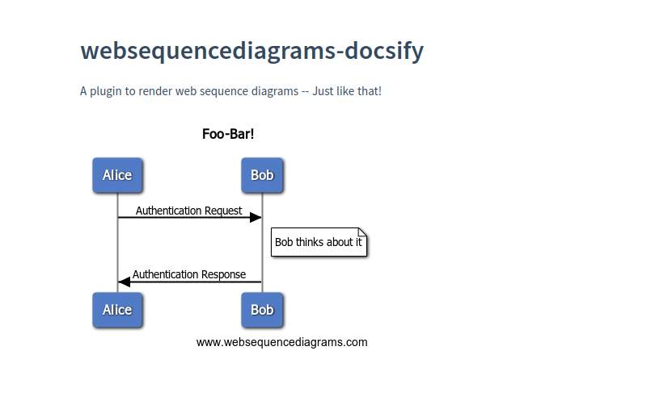

[](https://app.travis-ci.com/aajiwani/websequencediagrams-docsify)
# websequencediagrams-docsify

A plugin to render web sequence diagrams -- Just like that!

It would be as simple as writing this in your markdown, and applying the javascript to it. Docsify does the rest!

<pre>
```websequencediagrams
    title Foo-Bar!
    Alice->Bob: Authentication Request
    note right of Bob: Bob thinks about it
    Bob->Alice: Authentication Response
```
</pre>

## Impression

This is how the output looks and feel like



`Take a look at the live project` present [here](https://aajiwani.github.io/websequencediagrams-docsify)

---

## Integration in Docsify

There could be many ways of doing it, but the easiest would be something of this nature:

- Install Docsify appropriately and make sure you can run `docsify serve your_dir`

- Under `index.html` of your docsify installation, add this bit to enable this plugin

```html
<script src="//unpkg.com/websequencediagrams-docsify@2.0.1/dist/docsify-websequencediagrams.js"></script>
```

- Your end result would look something like this:

```html
<!DOCTYPE html>
<html lang="en">
<head> ... </head>
<body>
  <div id="app"></div>
  <script>
    window.$docsify = {
      name: '',
      repo: ''
    }
  </script>
  <script src="//cdn.jsdelivr.net/npm/docsify/lib/docsify.min.js"></script>
  <script src="//unpkg.com/websequencediagrams-docsify@2.0.1/dist/docsify-websequencediagrams.js"></script>
  ...
</body>
</html>
```

- You are now ready to consume websequence diagrams

- Add a `markdown` file within your docsify space stated below, and feel the magic!

<pre>
```websequencediagrams

title Foo-Bar!

Alice->Bob: Authentication Request
note right of Bob: Bob thinks about it
Bob->Alice: Authentication Response

```
</pre>

## Ways of running

Make sure you have `node` appropriately installed and either `npm` or `yarn` is available to you.

1. `yarn`
2. `yarn example &`
3. `yarn local_tests`

## References

Inspiration [project](https://github.com/Leward/mermaid-docsify)